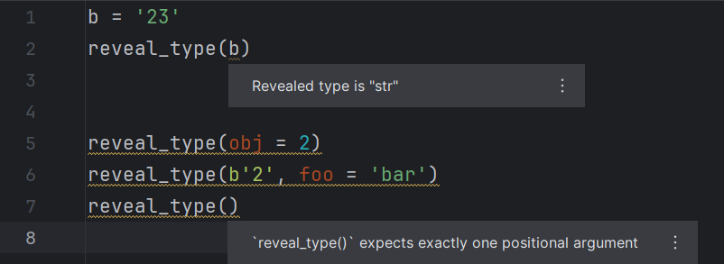

# `reveal_type()` support for PyCharm

[][2]

<!-- Plugin description -->
[`reveal_type()`][1] support for PyCharm.

See the type of an arbitrary expression as inferred by PyCharm
via visual annotations.

  [1]: https://typing.readthedocs.io/en/latest/spec/directives.html#reveal-type
<!-- Plugin description end -->

## Usage

Wrap an arbitrary expression with a `reveal_type()` call
to see its type as inferred by PyCharm.

This plugin has no inferrence logic on its own.
All calls to `reveal_type()` are recognized as directives,
regardless of the fully qualified name.

## Installation

This plugin is not available on the Marketplace.
You can download the ZIP files manually from [the <i>Releases</i> tab][3],
[the `build` branch][4] or [the <i>Actions</i> tab][5]
and follow the instructions described [here][6].

Currently supported versions:
2024.1 (build 241.14494.241) - 2024.2.* (build 242.*).

## Credits

Many parts of the code were derived from
and relevant parts of [the IntelliJ Community code base][7].
Some other files are based on or copied directly from
[@JetBrains/intellij-platform-plugin-template][8].

  [2]: https://github.com/InSyncWithFoo/reveal-type-for-pycharm/actions/workflows/build.yaml
  [3]: https://github.com/InSyncWithFoo/reveal-type-for-pycharm/releases
  [4]: https://github.com/InSyncWithFoo/reveal-type-for-pycharm/tree/build
  [5]: https://github.com/InSyncWithFoo/reveal-type-for-pycharm/actions/workflows/build.yaml
  [6]: https://www.jetbrains.com/help/pycharm/managing-plugins.html#install_plugin_from_disk
  [7]: https://github.com/JetBrains/intellij-community
  [8]: https://github.com/JetBrains/intellij-platform-plugin-template
